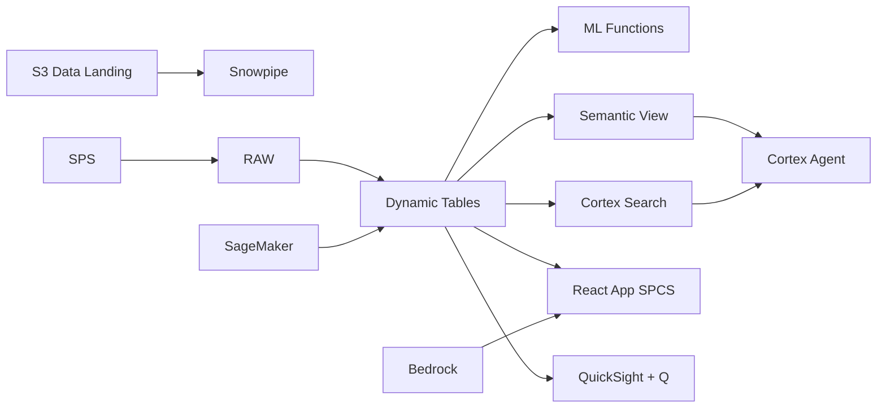

# Fabric Supply Chain

Fabric Supply Chain for Vietnam - ML.FORECAST and Dynamic Tables power real-time supply chain visibility intelligence for textile & garment in Ho Chi Minh City & Binh Duong.

## Architecture

Vietnam textile & garment faces increasing complexity in supply chain visibility. Decision-makers in Ho Chi Minh City & Binh Duong need real-time intelligence and ML-powered recommendations.



## Snowflake Capabilities

| Capability | Implementation |
|-----------|---------------|
| Dynamic Tables | PERFORMANCE_DASHBOARD / TREND_ANALYTICS / FORECAST_INPUT / OPERATIONAL_RISK |
| ML Functions | ML.FORECAST + ML.ANOMALY_DETECTION |
| Cortex AI | COMPLETE, SUMMARIZE, AI_CLASSIFY |
| Cortex Search | 100 documents indexed |
| Cortex Agent | TEXTILE_SUPPLY_CHAIN_AGENT |
| Semantic View | TEXTILE_SUPPLY_CHAIN_ANALYTICS |
| React App (SPCS) | 5 tabs + DemoGuide |


## AWS Services

| Service | Role in Demo |
|---------|-------------|
| AWS IoT Core | Ingest real-time data from textile & garment systems |
| Amazon SageMaker | Supply Chain Visibility ML models |
| AWS Glue | ETL and data transformation |
| Apache Iceberg (S3) | Open table format for data sharing |
| Amazon Bedrock (Claude) | Generate supply chain visibility recommendations |
| Amazon QuickSight + Q | Supply Chain Visibility dashboard with NL queries |


## Personas

| Persona | Role | Key Questions |
|---------|------|---------------|
| **Tran Minh Duc** | VP Supply Chain | "What are the key supply chain visibility metrics?" "Which areas need attention?" |
| **Le Thi Hoa** | Sourcing Manager | "Show me the trend analysis." "Which operations are underperforming?" |


## Data

| Table | Rows | Description |
|-------|------|-------------|
| OPERATIONS | 100,000 | Core operational records for supply chain visibility |
| METRICS | 500,000 | Time-series performance metrics |
| ASSETS | 5,000 | Asset and entity master data |
| EVENTS | 200,000 | Operational events and incidents |
| DOCUMENTS | 100 | SOPs, reports, and compliance docs |


## Build Instructions

### Prerequisites
- Snowflake account with ACCOUNTADMIN access
- Cortex AI enabled (ML Functions, Search, Agent)
- Warehouse: TEXTILE_WH (Medium)
- AWS CLI with access (us-west-2)

### Deployment

```bash
snowsql -f snowflake/00_setup.sql
snowsql -f snowflake/01_marketplace_install.sql
snowsql -f snowflake/02_raw_tables.sql
snowsql -f snowflake/03_staging.sql
snowsql -f snowflake/04_dynamic_tables.sql
snowsql -f snowflake/05_search.sql
snowsql -f snowflake/06_ml_models.sql
snowsql -f snowflake/07_semantic_view.sql
snowsql -f snowflake/08_agent.sql
```

### React App (SPCS)
```bash
cd app && npm ci && npm run build
docker build -t aws-vietnam-textile-supply-chain-app .
docker push bdiqc8sm-default.registry.snowflakecomputing.com/textile_supply_chain/app/aws_vietnam_textile_supply_chain/app:latest
```

### Demo Mode
Open the app URL with `?demo=true` for presenter view.

## Build Modes

### Snowflake Only
Run scripts 00-08 (skip AWS-specific integration). Uses:
- **Snowpipe Streaming SDK** instead of AWS IoT Core
- **ML.FORECAST + ML.ANOMALY_DETECTION** instead of Amazon SageMaker
- **Dynamic Tables** instead of AWS Glue
- **Snowflake-managed Iceberg Tables** instead of Apache Iceberg (S3)
- **Cortex Complete** instead of Amazon Bedrock (Claude)
- **Snowflake Intelligence (Cortex Analyst)** instead of Amazon QuickSight + Q

### Full AWS + Snowflake
Run all scripts including AWS integration. Deploy QuickSight dashboard from `quicksight/`.

## Business Impact

Industry research and Snowflake customer outcomes:
- **Vietnam imports 80% of fabric inputs ($15B annually), primarily from China, South Korea, and Taiwan** — [General Department of Customs Vietnam](https://www.customs.gov.vn/)
- **Supply chain disruptions cost the global apparel industry $100B in 2021-2023 — Vietnam was heavily impacted** — [McKinsey Fashion](https://www.mckinsey.com/industries/retail/our-insights/state-of-fashion-2024)
- **Multi-tier supply chain visibility reduces risk of forced labor violations — critical for UFLPA compliance** — [US Customs and Border Protection](https://www.cbp.gov/trade/forced-labor/UFLPA)
- **Under Armour** (Snowflake customer): consolidated global supply chain data on Snowflake, reducing time-to-insight from weeks to minutes across 35K retail doors -- [snowflake.com/customers/under-armour](https://www.snowflake.com/en/customers/all-customers/case-study/under-armour/)

## Key Demo Numbers

- **100K operations** tracked in Ho Chi Minh City & Binh Duong
- **500K metrics** time-series data points
- **5K assets** monitored
- **100 docs** searchable


## License

Apache 2.0 — See [LICENSE](LICENSE) for details.

This is a personal demo project and is not an official Snowflake offering. It comes with no support or warranty.